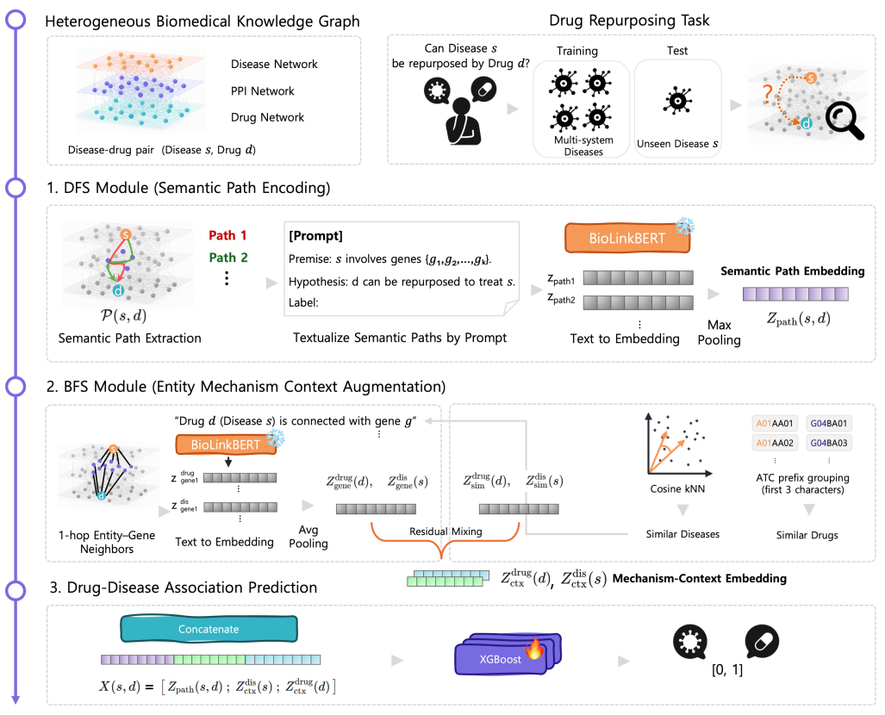

# CAREPath

**CAREPath (Context-Aware REasoning Path)** is a KG–LLM framework for **drug repurposing** that predicts disease–drug associations by combining:

- **DFS-like constrained semantic path encoding** over short disease–gene–drug paths  
- **BFS-like mechanism context augmentation** from 1-hop gene neighborhoods  

It then fuses these signals with **Node2Vec topology features** and scores pairs using an **XGBoost-based stacking ensemble**.

This repository includes code to:
1) **Extract per-pair embeddings** (semantic path + mechanism context + Node2Vec)  
2) **Run prediction and evaluation** (CV with random/drug/disease splits)

---

## What CAREPath does (high-level)



Given a disease–drug pair *(s, d)*:

### 1) Constrained semantic path encoding (DFS-like)
- Enumerate short simple paths **s → gene(s) → d** with constraints (e.g., max hop=3, limited number of genes).
- Convert each path into an NLI-style prompt:
  - `Premise: {disease} involves genes {g1, ..., gk}.`
  - `Hypothesis: {drug} can be repurposed to treat {disease}.`
  - `Label:`
- Encode each prompt with **BioLinkBERT (CLS)** and aggregate via **max pooling** to obtain a pair-specific semantic path embedding **Z_path(s,d)**.
- If no path exists, use a fallback prompt with `genes none`.

### 2) Mechanism context augmentation (BFS-like)
- Build entity-level context from **1-hop gene/protein neighbors only** (to reduce direct disease–drug leakage).
- Encode neighborhood sentences with BioLinkBERT and mean-pool into initial context embeddings.
- Apply similarity-guided pooling + residual mixing:
  - **Drugs:** pool within ATC-prefix–related drugs
  - **Diseases:** pool via gene-signature similarity (cosine kNN on weighted gene vectors)
- Produces robust context embeddings **Z_ctx^drug(d)** and **Z_ctx^dis(s)**, especially when paths are sparse/noisy.

### 3) Feature fusion + prediction
- Concatenate features:
  - `Node2Vec(drug)`, `Node2Vec(disease)`, `Z_path(s,d)`, `Z_ctx^drug(d)`, `Z_ctx^dis(s)`
- Score with an **XGBoost stacking ensemble** for final association probability.

---


## Usage

## 📦 Multiscale Interactome (MSI) Network

Our work builds on the **Multiscale Interactome (MSI)** network, a publicly available biological interaction network that integrates drug targets, disease perturbations, protein–protein interactions, and a hierarchy of biological functions into a unified graph. The official MSI network repository is available on GitHub:  
🔗 https://github.com/snap-stanford/multiscale-interactome  [oai_citation:2‡GitHub](https://github.com/snap-stanford/multiscale-interactome)


Below are minimal runnable commands you can copy/paste.  
Replace paths with your dataset locations.

---

## 1) Extract embeddings

This step creates a per-pair embedding dictionary (`.pkl`) keyed by `"{disease}__{drug}"`.

### Example (MSI)

```md
python -m extract_embeddings.main \
  --network_file "MSI dataset/graph.txt" \
  --node_type_file "MSI dataset/nodetypes.tsv" \
  --pair_file "MSI dataset/dda_labels.tsv" \
  --output_file "outputs/msi_embeddings.pkl" \
  --seed 42 \
  --max_genes 2 \
  --workers 5 \
  --run_id 0
```

## 2) Train and Prediction
```md
python -m prediction.train_and_prediction \
  --embedding_file "outputs/msi_embeddings.pkl" \
  --pair_file "MSI dataset/dda_labels.tsv" \
  --seed 42 \
  --n_splits 5 \
  --splits "random,drug,disease" \
  --output_file "outputs/cv_results.tsv" \
  --pred_detail_file "outputs/cv_pred_details.tsv"
```
